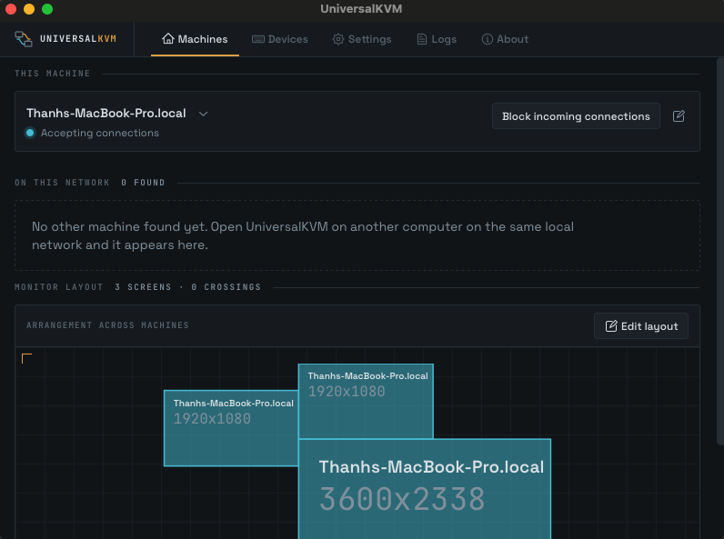

# UniversalKVM

One keyboard and mouse, driving every computer on your desk.



UniversalKVM is a software KVM. It sends keyboard and mouse events between computers
over your local network, so the cursor crosses from one machine to the next as if your
screens belonged to a single display. It also carries the clipboard, moves files, and
lets you choose exactly which screen edges connect.

It reads the lowest level input events the operating system exposes, in order to emulate
keys and movement as accurately as possible. It was written because few free, open
source KVMs work well across Linux, macOS, and Windows at once for demanding work such
as programming.

Found a bug, something missing, or have an idea? Open an issue or a discussion.

---

## Quick start

You need UniversalKVM installed on **every** machine you want to link, all on the same
local network. Install it first (see [Installation](#installation), including the
permissions your platform needs), then:

1. **Name each machine and set a password.** Open the **Machines** tab. Under *This
   machine*, click the pencil, enter a name you will recognise and a password, then
   **Save changes**. Use the same password on every machine.

   A password is optional but recommended. Without one, anyone else on the network can
   open UniversalKVM and control your computer.

2. **Connect them.** Each machine appears under *On this network* on the others. Click
   **Connect**. The lamp turns cyan and the status reads `Connected` once both sides
   agree.

3. **Choose which devices to share.** Open the **Devices** tab and turn on the keyboards
   and mice whose events should reach the other machines. Anything left off keeps
   working normally on this machine only.

4. **Arrange the screens.** Back on **Machines**, scroll to *Monitor layout* and click
   **Edit layout**. Drag each machine's screens into the positions they physically sit
   in, then **Save layout**.

5. **Link the edges the cursor should cross.** Still in edit mode, click an edge on one
   screen, then click the facing edge on another machine's screen. The pair is drawn in
   its own colour. Repeat for every crossing you want, then **Save layout**.

   Only linked edges let the cursor through. This is deliberate: you decide where the
   boundaries are, rather than the app guessing.

Move your mouse into a linked edge and it continues onto the other machine. Your
keystrokes follow the cursor.

## Daily use

**Send the keyboard and mouse to a specific machine.** On the **Machines** tab, click
that machine's screen in *Monitor layout*. A ring shows where the cursor will land.

**Copy the clipboard across.** With *Share clipboard* on in **Settings**, the clipboard
follows the cursor automatically whenever the focus moves. To pull the clipboard from a
machine without moving the cursor there, click the clipboard button on its row.

Content up to roughly 50-100 MB is supported.

**Send files or folders.** Drag them from your file manager onto a connected machine's
row on the **Machines** tab. Connected rows highlight while you drag, and the one under
the cursor highlights brighter. Files land in the download folder set under
**Settings** → *Received files go to*.

**Stop accepting connections.** Click **Block incoming connections** under *This
machine*. Click again to start accepting.

**Check on problems.** The **Logs** tab keeps this session's log in memory. Errors are
marked with `!` and counted on the tab. Logs never record keystrokes or mouse movement.

## Settings

| Setting | What it does |
| --- | --- |
| Theme | Dark or Light. |
| Zoom | Scales the whole interface, 25% to 1000%. |
| Width / Height at startup | Window size the app opens at. |
| Share clipboard | Copies the clipboard from the machine that had the cursor whenever the focus moves. |
| Reconnect automatically | Reconnects to machines you have already paired, without asking again. |
| Received files go to | Folder that receives dragged files. |
| Settings folder | Where the configuration file lives. Read-only. |

Number and text fields apply when you press Enter. An unsaved field says so underneath.

Border placements are remembered per monitor arrangement. When UniversalKVM sees an
arrangement it has not seen before, borders start empty for that arrangement.

## What it cannot do

**Everywhere**

* The keyboard layout is not translated. Typing on a Canadian English layout and sending
  to a Canadian French machine produces the Canadian French output.
* It cannot easily be set up to launch before the login screen.
* Login and lock screens are not fully supported and may not work at all.
* Passwords and the network secret are stored as plain text on the host machine. Network
  traffic itself is encrypted with libp2p.

**Linux**

* Requires `input` group permission. Root works too, if security is not a concern.
* On Wayland, borders are unlikely to work.

**macOS**

* Requires the accessibility and local network permissions.

**Windows**

* Some features require admin privileges. For example, sending events to an application
  that runs as administrator requires UniversalKVM to run as administrator too.
* Working on the login screen or an admin prompt requires admin privileges and PsExec.
* Dragging files onto the window only works when UniversalKVM runs *without* admin
  privileges.
* Some keyboard events only arrive while the UniversalKVM window has focus and no menu
  is open.

---

## Installation

Grab the installer for your platform from the
[latest release](https://github.com/tranhoangtuan148/UniversalKVM/releases/latest).
Every asset is named `UniversalKVM-<version>-<platform>.<ext>`:

| Platform | File |
| --- | --- |
| macOS, Apple silicon (M1 and later) | `UniversalKVM-1.0.3-macOS-AppleSilicon.dmg` |
| macOS, Intel | `UniversalKVM-1.0.3-macOS-Intel.dmg` |
| Debian, Ubuntu, Mint | `UniversalKVM-1.0.3-Linux-x86_64.deb` |
| Fedora, RHEL | `UniversalKVM-1.0.3-Linux-x86_64.rpm` |
| Any Linux, portable | `UniversalKVM-1.0.3-Linux-x86_64.AppImage` |
| Windows | `UniversalKVM-1.0.3-Windows-x64.msi` |

Substitute the version you are installing. On macOS, `uname -m` prints `arm64` for
Apple silicon and `x86_64` for Intel.

### Linux

UniversalKVM needs access to input devices. Add your user to the `input` group:

```sh
groups                          # optional, shows the groups your user is in
sudo usermod -aG input $USER
```

On Red Hat based distributions such as Fedora, also allow the `input` group to reach
`uinput`, which input emulation needs:

```sh
echo "uinput" | sudo tee /etc/modules-load.d/uinput.conf
echo 'KERNEL=="uinput", GROUP="input"' | sudo tee /etc/udev/rules.d/uinput.rules
```

Log out and back in, or restart, for the group to apply. To undo the group change later:

```sh
sudo gpasswd -d $USER input
```

Then install the package for your distribution:

* Debian, Ubuntu, Mint: download `UniversalKVM-1.0.3-Linux-x86_64.deb` and install it.
* Fedora and other Red Hat based distributions: download
  `UniversalKVM-1.0.3-Linux-x86_64.rpm` and install it.
* Any distribution: download `UniversalKVM-1.0.3-Linux-x86_64.AppImage`, make it
  executable with `chmod +x`, and run it. No installation needed.

Granting the `input` group to one executable and user is more secure than adding the
group to your user globally.

### macOS

1. Download the `.dmg` for your Mac's architecture and drag **UniversalKVM** to
   Applications.

2. Clear the quarantine flag:

   ```sh
   xattr -dr com.apple.quarantine /Applications/UniversalKVM.app
   ```

   Without this, macOS reports *"UniversalKVM is damaged and can't be opened"*. The
   build is not signed with an Apple Developer ID and is not notarized, so Gatekeeper
   refuses it. Right-click → Open does not get past this particular error; the
   attribute has to come off.

   That command tells macOS to stop treating the app as an untrusted download, so only
   run it on a file you trust. You can check the download against the `sha256` of the
   release asset first.

3. Grant accessibility: **System Settings** → **Privacy & Security** →
   **Accessibility** → add **UniversalKVM**.

4. Launch it once and grant the local network permission when prompted.

5. Quit and reopen the app, so the local network permission takes effect.

### Windows

1. Download `UniversalKVM-1.0.3-Windows-x64.msi` and install it.

   The installer is unsigned, so SmartScreen shows *"Windows protected your PC"*.
   Choose **More info** → **Run anyway** to continue.

2. If **Smart App Control** is on, it blocks the app outright: *"Smart App Control
   blocked an app that may be unsafe ... we could not verify its publisher"*. This is a
   separate check from SmartScreen, it applies to any executable it cannot verify, and
   it has **no per-app exception** — the dialog offers no *Run anyway*.

   The verdict is made per file, so one build can run while the next is blocked even
   though nothing about the app changed. Two ways past it:

   * Turn Smart App Control off: **Windows Security** → **App & browser control** →
     **Smart App Control** → **Off**. Read this first: turning it off is one way, and
     turning it back on requires reinstalling Windows. Defender and SmartScreen keep
     working either way.
   * Or run a build signed with a certificate Smart App Control trusts. These releases
     are not signed, so that means building and signing it yourself for now.

   Smart App Control only ships enabled on a clean install of Windows 11, so most
   machines never see this.

3. Optional, for login screens and admin prompts: download
   [PsExec](https://learn.microsoft.com/sysinternals/downloads/psexec) and make a
   shortcut that launches UniversalKVM through it, with the target set to:

   ```
   C:\path\to\PsExec.exe -s -i -d "C:\Program Files\UniversalKVM\UniversalKVM.exe"
   ```

   Run that shortcut as administrator.

---

## Building from source

Install the Tauri prerequisites for your platform:
<https://v2.tauri.app/start/prerequisites/>

```sh
pnpm install                              # install node modules
pnpm tauri dev                            # run in development
pnpm tauri build --debug --no-bundle      # quick compile, no installer
pnpm tauri build                          # release build with installers
```

The frontend is React and TypeScript through Vite; the backend is Rust through Tauri 2.
See [AGENTS.md](AGENTS.md) for how the two halves fit together.
